# Mastra Examples

このリポジトリには、Mastraを使用した様々な例が含まれています。

## プロジェクト構造

```mermaid
graph TD
    A[mastra.example/] --> B[system-prompt/]
    A --> C[agentic-workflows/]
    A --> D[frontend-ui/]
    A --> E[using-a-tool/]
    A --> F[hierarchical-multi-agent/]
    A --> G[multi-agent-workflow/]
    
    B --> B1[index.ts]
    B --> B2[package.json]
    B --> B3[.env.example]
    
    C --> C1[index.ts]
    C --> C2[package.json]
    C --> C3[.env.example]
    
    D --> D1[app/]
    D --> D2[components/]
    D --> D3[package.json]
    D --> D4[.env.example]
    
    E --> E1[index.ts]
    E --> E2[package.json]
    E --> E3[.env.example]
    
    F --> F1[index.ts]
    F --> F2[package.json]
    F --> F3[.env.example]
    
    G --> G1[index.ts]
    G --> G2[package.json]
    G --> G3[.env.example]
    
    style A fill:#f9f9f9,stroke:#333,stroke-width:1px
    style B fill:#d4f4ff,stroke:#333,stroke-width:1px
    style C fill:#ffe6cc,stroke:#333,stroke-width:1px
    style D fill:#e6ffcc,stroke:#333,stroke-width:1px
    style E fill:#ffcccc,stroke:#333,stroke-width:1px
    style F fill:#ffccff,stroke:#333,stroke-width:1px
    style G fill:#ccffff,stroke:#333,stroke-width:1px
```



| ディレクトリ | 説明 |
|------------|------|
| `system-prompt/` | システムプロンプトを使用して猫の事実を提供するエージェントを作成する例。 |
| `agentic-workflows/` | 天気予報データを取得し、それに基づいてアクティビティを提案するワークフローを作成する例。 |
| `frontend-ui/` | 上記の例を使用したフロントエンドUIアプリケーション。猫の専門家チャット、天気予報アプリ、天気アシスタント、ブログ記事ジェネレーター、ワークフローブログを含みます。 |
| `using-a-tool/` | エージェントがツールを使用する例。天気データを取得するためのカスタムツールを作成し、エージェントがそれを使用して天気情報を提供します。 |
| `hierarchical-multi-agent/` | 階層的マルチエージェントシステムの例。一つのエージェントが他のエージェントを調整して複雑なタスクを実行します。 |
| `multi-agent-workflow/` | マルチエージェントワークフローの例。複数のエージェントを順番に実行してブログ記事を作成します。 |

## 例の一覧

- [システムプロンプト付きエージェント](./system-prompt/README.md) - システムプロンプトを使用してエージェントを作成する簡単な例
- [エージェンティックワークフロー](./agentic-workflows/README.md) - エージェンティックワークフローを作成する簡単な例
- [ツールを使用するエージェント](./using-a-tool/README.md) - エージェントがカスタムツールを使用する簡単な例
- [階層的マルチエージェント](./hierarchical-multi-agent/README.md) - 階層的マルチエージェントシステムを作成する簡単な例
- [マルチエージェントワークフロー](./multi-agent-workflow/README.md) - マルチエージェントワークフローを作成する簡単な例
- [フロントエンドUI](./frontend-ui/README.md) - 上記の例を使用したフロントエンドUIアプリケーション

## 開発環境のセットアップ

### 前提条件

各例には独自の前提条件がありますが、一般的には以下が必要です：

- Node.js v20.0+
- pnpm（推奨）または npm
- OpenAI APIキー

### リポジトリのクローン

```bash
git clone https://github.com/WdknWdkn/mastra.example.git
cd mastra.example
```

### OpenAI APIキーの設定

各サンプルを実行するには、OpenAI APIキーが必要です。各ディレクトリ内の`.env.example`ファイルを`.env`にコピーし、APIキーを設定してください：

```bash
cp <サンプルディレクトリ>/.env.example <サンプルディレクトリ>/.env
```

次に`.env`ファイルを編集して、OpenAI APIキーを追加します：

```env
OPENAI_API_KEY=sk-your-api-key-here
```

### 始め方

各例のディレクトリに移動し、それぞれのREADME.mdファイルの詳細な指示に従ってください。

## トラブルシューティング

### OpenAI APIキーエラー

以下のようなエラーが表示される場合は、OpenAI APIキーが正しく設定されていません：

```
LoadAPIKeyError [AI_LoadAPIKeyError]: OpenAI API key is missing. Pass it using the 'apiKey' parameter or the OPENAI_API_KEY environment variable.
```

解決方法：
1. `.env.example`ファイルを`.env`にコピーしたことを確認
2. `.env`ファイルに有効なOpenAI APIキーが設定されていることを確認
3. アプリケーションを再起動
