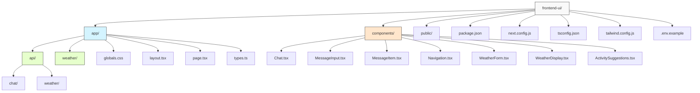

# Mastra フロントエンドUI

このプロジェクトは、Mastraを使用した2つのアプリケーションを提供するフロントエンドUIです：

1. **猫の専門家チャット** - 猫に関する質問に答える猫の専門家エージェントとチャットできるインターフェース
2. **天気予報とアクティビティ提案** - 指定した都市の天気予報を取得し、それに基づいたアクティビティを提案するインターフェース

## ファイル構造と役割



| ディレクトリ/ファイル | 役割 |
|------------|------|
| `app/` | Next.jsアプリケーションのメインディレクトリ。ページレイアウト、ルート、APIエンドポイントを含みます。 |
| `app/api/` | APIエンドポイントを含むディレクトリ。チャットと天気予報のAPIルートが含まれています。 |
| `app/weather/` | 天気予報ページのコンポーネントを含むディレクトリ。 |
| `components/` | 再利用可能なReactコンポーネントを含むディレクトリ。チャットインターフェース、天気表示、フォームなどのコンポーネントが含まれています。 |
| `Chat.tsx` | 猫の専門家とのチャットインターフェースを実装するコンポーネント。 |
| `MessageInput.tsx` | チャットメッセージ入力フォームを実装するコンポーネント。 |
| `MessageItem.tsx` | チャットメッセージの表示を実装するコンポーネント。 |
| `Navigation.tsx` | アプリケーション間のナビゲーションを実装するコンポーネント。 |
| `WeatherForm.tsx` | 天気予報を取得するための都市入力フォームを実装するコンポーネント。 |
| `WeatherDisplay.tsx` | 天気予報データを表示するコンポーネント。 |
| `ActivitySuggestions.tsx` | 天気に基づいたアクティビティ提案を表示するコンポーネント。 |
| `package.json` | プロジェクトの依存関係と実行スクリプトを定義します。 |
| `next.config.js` | Next.jsの設定ファイル。 |
| `tsconfig.json` | TypeScriptの設定ファイル。 |
| `tailwind.config.js` | Tailwind CSSの設定ファイル。 |
| `.env.example` | 環境変数のテンプレートファイル。OpenAI APIキーを設定するために使用します。 |

## 開発環境のセットアップ

### 前提条件

- Node.js v20.0+
- npm または yarn
- OpenAI APIキー

### インストール手順

1. リポジトリをクローンしてプロジェクトディレクトリに移動します：

   ```bash
   git clone https://github.com/WdknWdkn/mastra.example.git
   cd mastra.example/frontend-ui
   ```

2. 依存関係をインストールします：

   ```bash
   npm install
   # または
   yarn install
   ```

### OpenAI APIキーの設定

アプリケーションを実行するには、OpenAI APIキーが必要です：

1. 環境変数ファイルをコピーします：

   ```bash
   cp .env.example .env
   ```

2. `.env`ファイルを編集してOpenAI APIキーを追加します：

   ```env
   OPENAI_API_KEY=sk-your-api-key-here
   ```

## アプリケーションの実行

設定が完了したら、開発サーバーを起動できます：

```bash
npm run dev
# または
yarn dev
```

ブラウザで [http://localhost:3000](http://localhost:3000) を開いてアプリケーションを表示します。

## 機能

### 猫の専門家チャット
- 猫に関する質問をチャットインターフェースで送信
- 猫の専門家AIからの応答を受信（常に興味深い猫の事実を含む）
- レスポンシブデザインで様々なデバイスに対応

### 天気予報とアクティビティ提案
- 都市名を入力して天気予報を取得
- 天気に基づいた適切なアクティビティの提案を受け取る
- 3日間の天気予報を表示

## トラブルシューティング

### OpenAI APIキーエラー

以下のようなエラーが表示される場合は、OpenAI APIキーが正しく設定されていません：

```
LoadAPIKeyError [AI_LoadAPIKeyError]: OpenAI API key is missing. Pass it using the 'apiKey' parameter or the OPENAI_API_KEY environment variable.
```

解決方法：
1. `.env.example`ファイルを`.env`にコピーしたことを確認
2. `.env`ファイルに有効なOpenAI APIキーが設定されていることを確認
3. アプリケーションを再起動

### ネットワークタイムアウトエラー

天気データの取得中にタイムアウトエラーが発生する場合：

```
TypeError: fetch failed
```

解決方法：
1. インターネット接続を確認する
2. アプリケーションは自動的にモックデータを提供するフォールバック機能を実装しているため、基本的な機能は引き続き利用可能です
