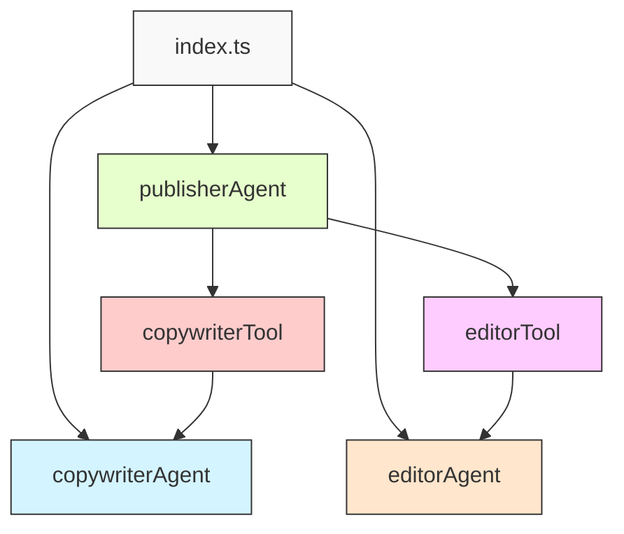

# 階層的マルチエージェントの例

ツールを使用して他のエージェントへの呼び出しを調整するスーパーバイザー計画エージェントの簡単な例です。

## プロジェクト構造



| コンポーネント | 説明 |
|------------|------|
| `copywriterAgent` | ブログ記事のコピーを書くエージェント |
| `editorAgent` | ブログ記事のコピーを編集するエージェント |
| `publisherAgent` | 他のエージェントを調整するスーパーバイザーエージェント |
| `copywriterTool` | コピーライターエージェントを呼び出すためのツール |
| `editorTool` | エディターエージェントを呼び出すためのツール |

## 前提条件

- Node.js v20.0+
- pnpm（推奨）またはnpm
- OpenAI APIキー

## 始め方

1. リポジトリをクローンしてプロジェクトディレクトリに移動します：

   ```bash
   git clone https://github.com/WdknWdkn/mastra.example.git
   cd mastra.example/hierarchical-multi-agent
   ```

2. 環境変数ファイルをコピーしてOpenAI APIキーを追加します：

   ```bash
   cp .env.example .env
   ```

   次に`.env`を編集してOpenAI APIキーを追加します：

   ```env
   OPENAI_API_KEY=sk-your-api-key-here
   ```

3. 依存関係をインストールします：

   ```
   pnpm install
   ```

4. 例を実行します：

   ```bash
   pnpm start
   ```

## 動作の仕組み

1. `publisherAgent`はユーザーからブログ記事のトピックを受け取ります
2. `publisherAgent`は`copywriterTool`を使用して`copywriterAgent`を呼び出し、ブログ記事のコピーを生成します
3. `publisherAgent`は`editorTool`を使用して`editorAgent`を呼び出し、生成されたコピーを編集します
4. `publisherAgent`は最終的な編集されたコピーを返します
