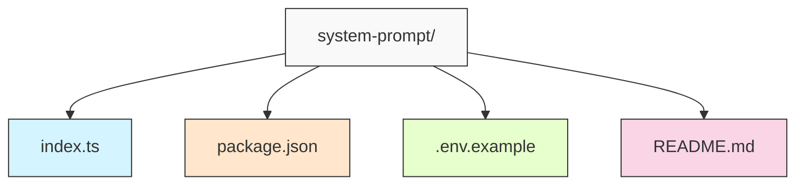

# システムプロンプト付きエージェント

システムプロンプトを使用してエージェントを作成する簡単な例です。このサンプルでは、猫に関する事実を提供するエージェントを作成します。

## ファイル構造と役割



| ファイル名 | 役割 |
|------------|------|
| `index.ts` | メインのアプリケーションコード。猫の事実を提供するエージェントを定義し、実行します。システムプロンプトとツールの設定が含まれています。 |
| `package.json` | プロジェクトの依存関係と実行スクリプトを定義します。`@ai-sdk/openai`、`@mastra/core`、`zod`などの依存関係が含まれています。 |
| `.env.example` | 環境変数のテンプレートファイル。OpenAI APIキーを設定するために使用します。 |
| `README.md` | プロジェクトの説明、セットアップ手順、実行方法などのドキュメントを提供します。 |

## 開発環境のセットアップ

### 前提条件

- Node.js v20.0+
- pnpm（推奨）または npm
- OpenAI APIキー

### インストール手順

1. リポジトリをクローンしてプロジェクトディレクトリに移動します：

   ```bash
   git clone https://github.com/WdknWdkn/mastra.example.git
   cd mastra.example/system-prompt
   ```

2. 依存関係をインストールします：

   ```bash
   pnpm install
   # または
   npm install
   ```

### OpenAI APIキーの設定

サンプルを実行するには、OpenAI APIキーが必要です：

1. 環境変数ファイルをコピーします：

   ```bash
   cp .env.example .env
   ```

2. `.env`ファイルを編集してOpenAI APIキーを追加します：

   ```env
   OPENAI_API_KEY=sk-your-api-key-here
   ```

## サンプルの実行

設定が完了したら、サンプルを実行できます：

```bash
pnpm start
# または
npm start
```

## トラブルシューティング

### OpenAI APIキーエラー

以下のようなエラーが表示される場合は、OpenAI APIキーが正しく設定されていません：

```
LoadAPIKeyError [AI_LoadAPIKeyError]: OpenAI API key is missing. Pass it using the 'apiKey' parameter or the OPENAI_API_KEY environment variable.
```

解決方法：
1. `.env.example`ファイルを`.env`にコピーしたことを確認
2. `.env`ファイルに有効なOpenAI APIキーが設定されていることを確認
3. アプリケーションを再起動
